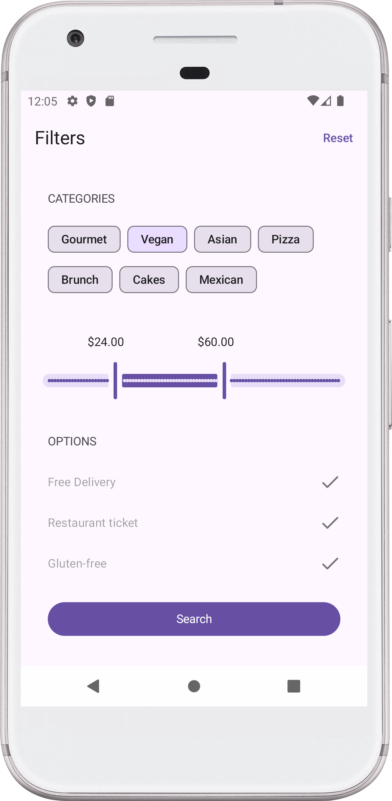
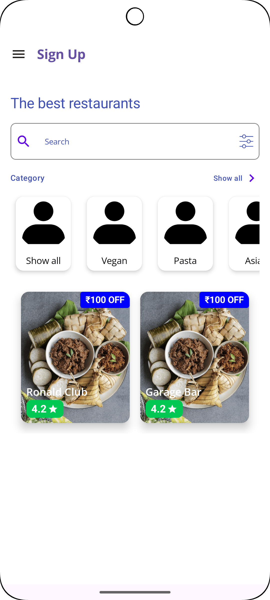
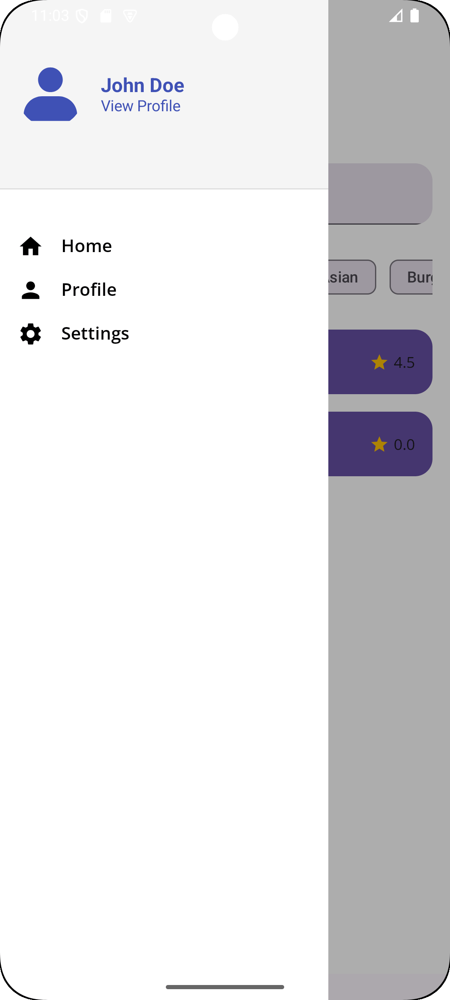
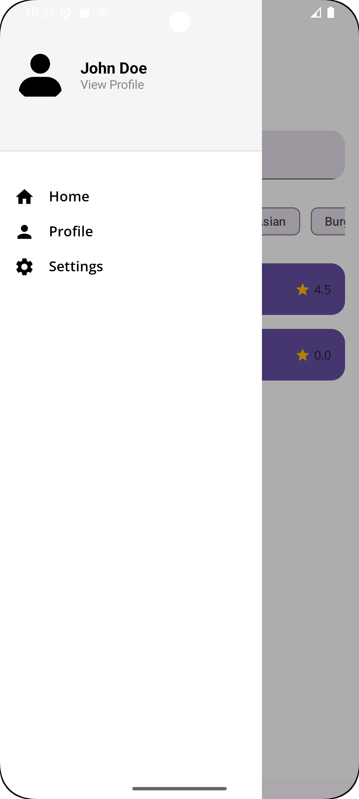
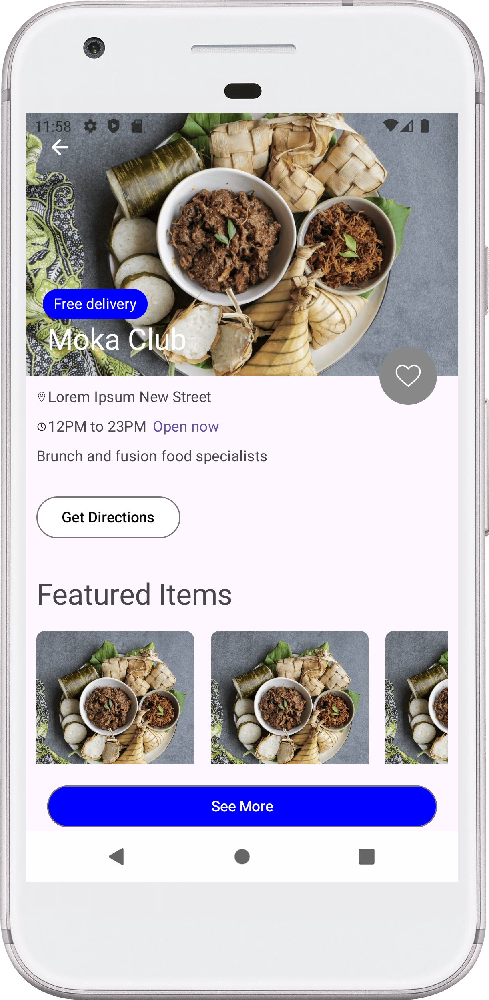
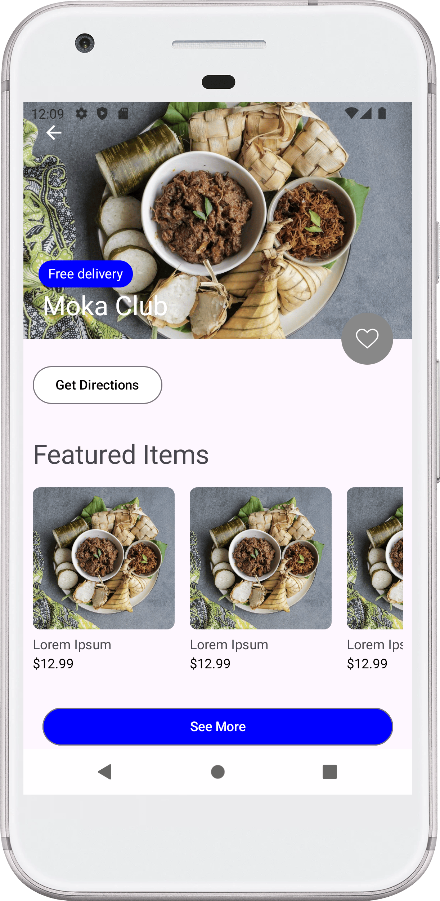

  

# Food delivery app

A sample food delivery application for a coffee shop.

## Features
- Login & Registration & Forgot Password
- Discover & Filters & Categories
- Home & Resturant List & Fevorite & Notication List
- Resturant Details Page
- Menu & Order & CheckOut & Successfully order

## Technologies
- Kotlin & Coroutines & Clean Architecture & Jetpack Compose: Primary programming language
- Room DataBase: For local database management
- Flow & StateFlow & Hilt: For dependency injection
- FireStore Firebase , PushNotification
- Firebase: For messaging and authentication

## Screenshots

  
  
  
  
  
  
  

